## Instructions for contributing with git and GitHub

### Prerequisites and other options
-   Editing requires a GitHub account. You can set one up at <https://github.com>
-   If you don’t want to use Github, you can suggest changes by emailing a lesson maintainer
    -   TODO add link to contact maintainers

Note: The GitHub webpage interface works well for making relatively small edits, like adding a link, fixing typos, or adding several lines of explanation. For larger edits, the command line interface is recommended.

### Contents
-   Option 1- Use a graphical interface (the GitHub webpage)
-   Option 2- Use a command line interface with git


### Glossary of some version control vocabulary related to git and GitHub
-   **For more details, see the Carpentry [git lesson reference page](http://swcarpentry.github.io/git-novice/reference/)**
-   TODO - review definitions, figure out how much detail to include, potentially reorder
-   *repository (short form: repo)*
    -   a storage area for a project containing all the files for the project and the history of all the changes made to those files
-   *local copy*
    -   a version of file stored on your own computer
-   *remote copy (also called upstream copy)*
    -   a version of a file stored outside of your own computer, for example stored on an external server
-   *branch*
    -   a *branch* is a named series of commits. The default branch when you download a Carpentry lesson is called **gh-pages**. Creating a new branch makes a parallel version of a repository where changes can be made that affect the new branch only and not the original (base) version of the repository.  New branches are often used to test changes or new ideas, which can later be merged with the base branch. Moving from one branch to another is called *checking out* a new branch.
-   *gh-pages* (GitHub-specific term)
    - stands for "GitHub Pages". This is the name of the main branch in each of the Carpentry lesson material repositories. Branches called gh-pages can be published as webpages hosted by GitHub.
-   *origin*
    -   a remote repository you want to download files from or compare local changes you have made to
-   *push*
    -   send saved changes you have made on your local computer to a remote repository. For a change to show up on GitHub, the saved changes must be *pushed* from your computer to the remote repository.
-   *pull*
    -   download saved changes from a remote repository to your local version of the same repository. This is useful when other people have made changes to a shared project, and you want to download (*pull*) the changes from the shared remote repository to your own computer.
-   *pull request* (GitHub-specific term)
    -   send proposed changes from a specific version of a repository back to the main version of a repository to be considered for incorporation by the people maintaining the repository (the maintainers)
-   *fork* (GitHub-specific term)
    -   to copy a repository from another user and store it under your own account.

## Option 1 - Use a graphical interface (the GitHub webpage)

### Getting Ready:

1.  Identify the url and repository name for the lesson you want to make changes for, eg <https://github.com/swcarpentry/git-novice>. The base branch in all the Carpentry lessons is called **gh-pages**.

2.  It’s not possible to for you to directly edit the version of the lesson in the Carpentry repository, so the overall idea of “GitHub Flow” is that you can submit edits by:

    1) making your own copy of the lesson repository

    2) making a branch in your own copy

    3) making the changes on that dedicated branch, and then

    4) sending your proposed changes back to the Carpentry version of the repository by creating a **pull request**.

3.  Have you already forked the repository for this lesson?

    If **NO** (you have not yet forked the repository for this lesson):

    a) Fork a copy of the lesson repository's  ```gh-pages``` branch into your account. Do this by selecting ```gh-pages``` on the dropdown option of branches on the left hand side of the repository's page, then clicking the 'Fork' button in the upper right:

    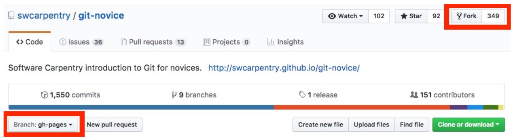

    b) When the *“Where should we fork this repository?”* screen appears, click on your GitHub username (or other organizational account, if you are a member of any other organizations on GitHub).

    c) The lesson will then be forked into a new copy of the repository under your username or your organizational account (it may take a minute or two for the copying to complete). Now you are ready to make edits.

    If **YES**:

    TODO: clean up indenting/numbering for this section

    a) If you just made the fork, go on to [Making Your Edits](TODO add link).

    b) If you made the fork a while ago, make sure it is up to date with the latest changes in the Carpentry lesson repository with these instructions before starting to edit:

    Check the status of your repository - look if there is a message underneath the navigation bar, such as *"This branch is <#> commits behind ...*"

   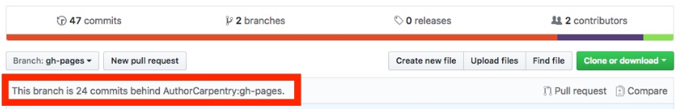

  -   If the message says that your branch is **even**, proceed to the [Making Your Edits](TODO add link) section.

  -   If it says that your branch is **behind**,  click the grey *"Compare"* icon (below the green *"Clone or download"* button)  on the right:

  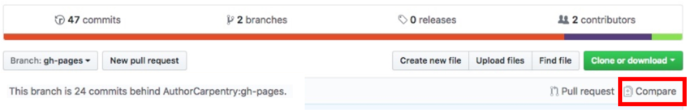

  TODO: describe what to do after hitting "Compare" here

  -   If you see a message saying **there isn’t anything to compare**, such as -

  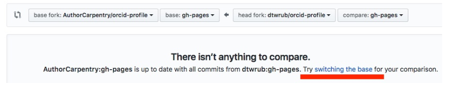

  That means that GitHub is comparing your changes with the master repository. In other words, everything that you have, the master has too. In order to make the opposite comparison - to see what the master has that you do not - click on the *“switching the base”* link.

  You should now see something similar to:

  

  The base and head forks have now been switched, so the comparison is now between the changes in the master repository and yours.

  Click *“Create pull request”* - this is creating a pull request to you (for your repository) asking to pull changes from the master repository into your repository. Enter a title for the request and then click the green *"Create pull request"* button.

  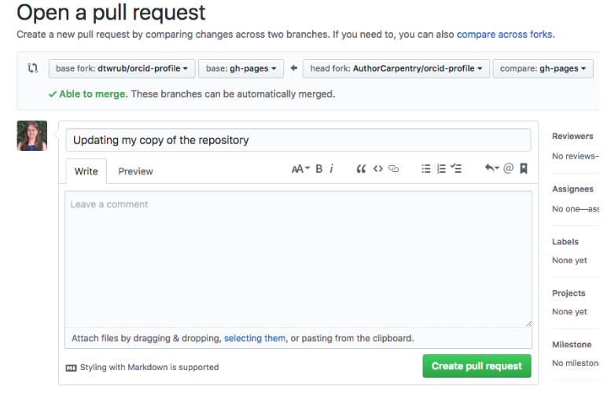

  On the next screen click *“View pull request”* to view the pull request you just created for your repository. Towards the bottom of the screen, look for this message:

  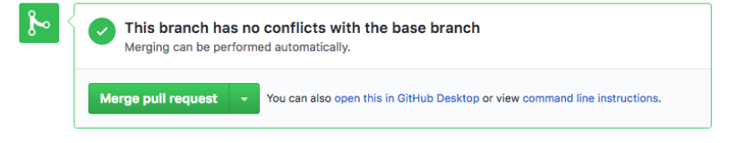

  Click on *“Merge pull request”*, add any notes you want, then click *“Confirm merge”*.

  The status should now be *“Merged”*, and your repository will be up to date with all the changes from the remote repository! Congrats, you are ready to start making your edits!

### Making your edits

1.Create a new branch in your fork of the base repository. It's best practice to make each significant change in a separate fork so each significant change can be submitted as a separate pull request. Create a new branch by clicking on the *'Branch'* dropdown, and entering a new branch name in the *“Find or create a branch…”* dialog

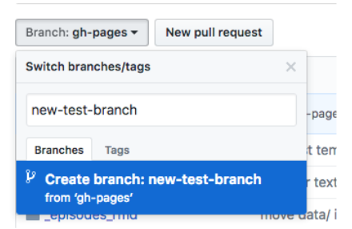

 Click the blue *“create branch”* button and this will create a copy of whatever branch you have selected in the drop-down (in this case, `gh-pages`) into a new branch named whatever you enter for the name.

2.Make your changes to files in the branch you just created. Since you are making changes in a branch you just created, select *“Commit directly”* and then click *“Commit changes”*:

  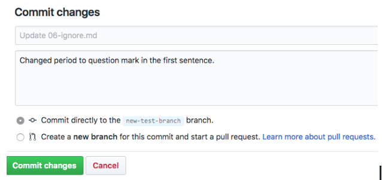

3.You’ll now see that your new branch with the edits will be a commit ahead of the base branch - click on *“Pull request”* to open the Pull Request submission screen to submit those changes to the master repository for consideration:

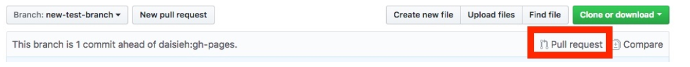

4.Add a short explanation of your suggested changes, then press *“Submit Pull Request”* at the bottom of the page. It will be helpful if your description is more detailed than the commit message (eg you can explain why you changed something). People will be able to see the code you changed though, so you don’t have to repeat every single thing you changed.

If you make more changes to this branch after making the pull request, those changes will automatically get added to the existing pull request, as long as the pull request hasn't been closed.

5.Wait for feedback from the community on your Pull Request!

6.If you receive feedback, make the changes on GitHub and the pull request will update automatically.

## Option 2 - Use a command line interface with git

### Getting ready

1.Identify the url and repository name for the lesson you want to make changes for, eg <https://github.com/swcarpentry/git-novice>. The main branch in all the Carpentry lessons is called **gh-pages**.

2.It’s not possible to directly edit the version of the lesson in the Carpentry repository, so the overall idea of “GitHub Flow” is that you can submit edits by: 1) making your own copy of the lesson repository, 2) making a branch in your own copy, 3) making the changes on that dedicated branch, and then 4) sending your proposed changes back to the Carpentry version of the repository by creating a pull request.

3.Have you already forked the repository for this lesson?

  -   If **NO** :

      a) a) Fork a copy of the base repository's  ```gh-pages``` branch into your account. Do this by selecting ```gh-pages``` on the dropdown option of branches on the left hand side of the repository's page, then clicking the *'Fork'* button on the upper right:

      

      b) When the *“Where should we fork this repository?”* screen appears, click on your Git username (or other organizational account, if you are a member of any other organizations on GitHub)

      c) Once the lesson has been forked to your repository, click the green *“Clone or download”* button on the right side of the screen, and copy the url that pops up below:

      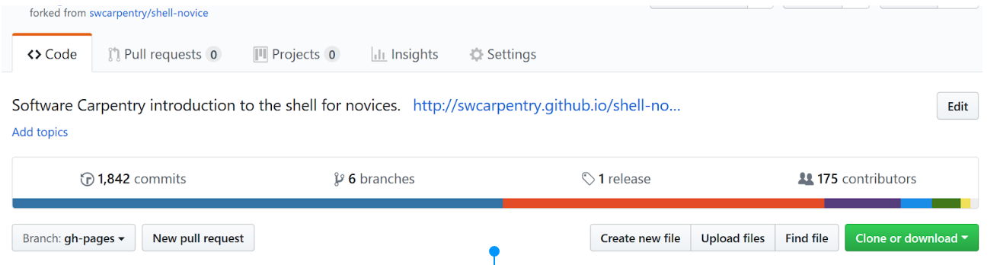

      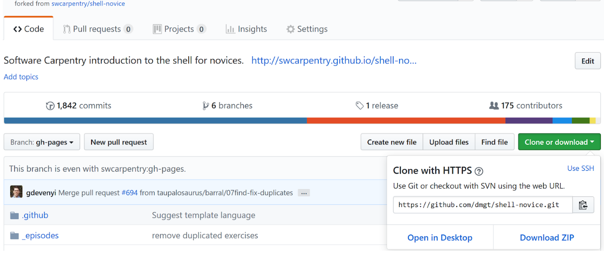

      The url will end in *.git* and look something like this:
         *<https://github.com/yourgithubusername/lessonname.git>*

      For example if your username was `daisieh` and you forked the `git-novice` lesson the url will be <https://github.com/daisieh/shell-novice.git>

      d) Open your terminal, navigate to a folder you want to keep your copy of the lesson in, and use `git clone` to copy the files from your repository on GitHub to your local computer:

      `git clone https://github.com/yourgithubusername/lessonname.git`

      e) Lastly, you need to add the repository you forked from as a remote using the format `git remote add nameyouchooseforremote https://github.com/url/for/lesson`

      For example: `git remote add swcarpentry https://github.com/swcarpentry/shell-novice`

      Confirm the new remote shows up with `git remote show`. You should see at least two names, including `origin` (or whatever your online repository is called) and the name of your remote, eg `swcarpentry`

      f) You’re all set up - go to step 4 to make your edits

  -   If **YES**:

      a) Confirm what remote repositories your local copy of the lesson can connect to:

        `git remote show`

        - In the output, if you see two or more names, including `origin` (your repository online) and the name of the account you forked from, eg `swcarpentry`, go on to the next step.

        - If you only see `origin`, you need to add the repository you forked from as a remote using `git remote add nameyouchooseforremote https://github.com/url/for/lesson `

        For example, to add the *shell-novice* lesson as a remote named *swcarpentry*:
        `git remote add swcarpentry https://github.com/swcarpentry/shell-novice`

        Confirm the new remote shows up with `git remote show` and you're ready for the next step

   b)  It’s best practice to make sure your copy of the lesson is up-to-date with the latest changes to the Carpentry version of the lesson, so the difference between your proposed changes and the existing lesson will only be the edits you’re about to make, and not include extra differences between older and newer versions of the lesson you’re editing. We’re going to use `git pull`, assuming you are ok to overwrite your current version of the lesson with the most recent version from the Carpentry repo:

   `git pull`

   c) Commit your update, using the `-m` flag to include a short  message explaining what changed inside quote marks:

   ` git commit -m “updates from latest Carpentry lesson"`

    d) Push your newly updated local copy of `gh-pages` back to your own remote repository too:

    `git push`

    Now you’re ready to start editing!

    Note: some open source projects refer to the main branch as `master` , so you may see this term used in other examples online, instead of `gh-pages`.

### Making your edits

4.For each change or group of changes you want to make, start by making a new branch on your local copy of the repository with `git checkout -b newbranchname`. It’s helpful to give the branch a relevant  name eg:

`git checkout -b extraexamples`
 or
`git checkout -b fixtypo`

You can see a list of existing branches, and the branch you’re currently on with the command `git branch`

5.On your new branch, make your edits and commit the changes in that branch.

For example: `git commit -m “Added grep example to section 3” `

6.Staying on the same branch, push your local edited branch to your fork of the lesson on GitHub with `git push origin newbranchname`.

For example: `git push origin extraexamples`

7.Go back to your forked repository on GitHub in your internet browser, and navigate to your new branch using the dropdown menu under the **branch** button:

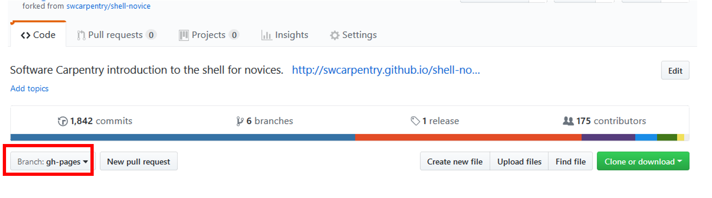

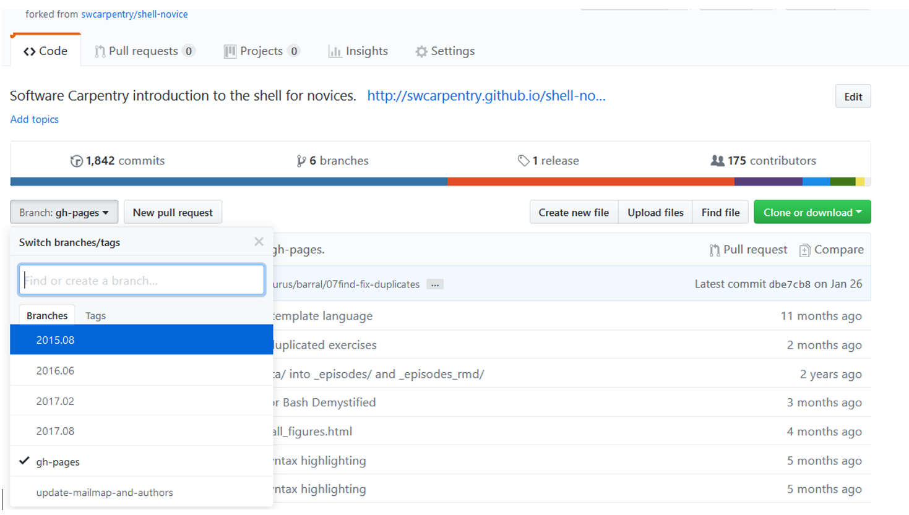

8.Once on your new branch, press the green “Compare and Pull Request Button” on the right:

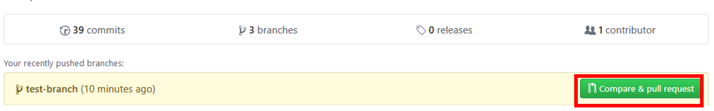
*Example where the name of the most recently push branch is called 'contributing'*

9.Add a short explanation of your suggested changes, then press “Submit Pull Request” at the bottom of the page.
It will be helpful if your description is more detailed than the commit message (eg you can explain why you changed something). People will be able to see the code you changed though, so you don’t have to repeat every single thing you changed.

10.Wait for feedback from the community on your pull request!

11.If you want to make additional changes (because you got feedback or think of related improvements), use the terminal to switch back to the branch on your local version that you made the previous edits on. The git command to return to a branch is `git checkout newbranchname`, e.g `git checkout extraexamples`.

Then make your additional changes,  and commit and push them.

When you look at the pull request on GitHub it will update automatically to include the new changes you've pushed.
